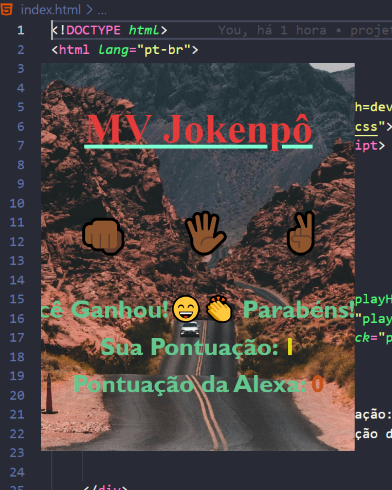

🎮 MV Jokenpô

Um jogo clássico de Pedra, Papel e Tesoura desenvolvido com HTML, CSS e JavaScript puro, onde o jogador enfrenta a "Alexa" 🤖 em partidas dinâmicas com placar em tempo real.

Agora totalmente responsivo, funcionando perfeitamente em 💻 computadores e 📱 celulares.

🌎 Demonstração

🔗 (Coloque aqui o link do GitHub Pages quando publicar)
Exemplo:

https://marvinmarvin2089-source.github.io/MV-Jogo/
📸 Preview

Adicione aqui um print do projeto rodando:

🚀 Funcionalidades

✔ Escolha entre Pedra ✊, Papel 🖐 ou Tesoura ✌
✔ Máquina faz escolha aleatória
✔ Sistema de pontuação em tempo real
✔ Mensagens personalizadas de vitória, derrota e empate
✔ Animação automática de fundo
✔ Interface moderna com emojis
✔ Layout centralizado com Flexbox
✔ Totalmente responsivo (desktop e mobile)

📱 Responsividade

O projeto utiliza:

Flexbox

flex-wrap

@media queries

max-width

Layout adaptável

Isso garante uma experiência fluida tanto em telas grandes quanto em smartphones.

🧠 Como Funciona

A máquina escolhe aleatoriamente uma opção:

const choices = ["rock", "paper", "scissors"]

Depois o sistema compara as escolhas usando estruturas condicionais:

Empate → mesmas escolhas

Vitória → combinações vencedoras

Derrota → demais casos

O placar é atualizado dinamicamente com manipulação do DOM.

🛠 Tecnologias Utilizadas

HTML5 → Estrutura da aplicação

CSS3 → Estilização, animações e responsividade

JavaScript (ES6) → Lógica do jogo e manipulação do DOM

📂 Estrutura do Projeto
mv-jokenpo/
│
├── index.html
├── style.css
├── script.js
└── README.md

🎨 Diferenciais

✨ Background animado com @keyframes
✨ Interface centralizada e moderna
✨ Uso de emojis para melhorar experiência do usuário
✨ Código organizado e de fácil entendimento
✨ Projeto ideal para iniciantes praticarem lógica

📚 Aprendizados

Neste projeto pratiquei:

Manipulação do DOM

Eventos onclick

Funções em JavaScript

Estruturas condicionais

Uso de Math.random()

Atualização dinâmica de elementos HTML

Responsividade com @media

Animações em CSS

👨‍💻 Autor

Marcus Vinícius
 
🚀 Desenvolvedor Front-End em evolução
